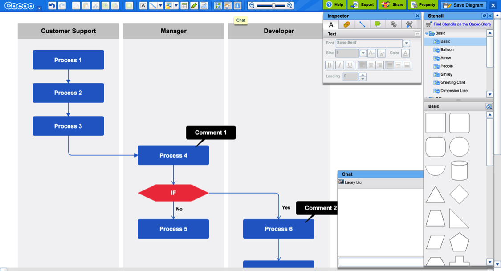

# GUI Design for Deep Thought

## 1. UI Layout

Three main purpose of UI: 

* Interface for user to design and modify network definition
* Definition of network structure for backend
* Visualize neurons and activations


### 1.1 Components

The UI should have 3 components: 

* Area for drawing
* Area for choosing neurons/layers/arrows
* Area for defining properties of neurons/layers
	

### 1.2 Network Representations

The following elements are used to represent the network: 

* Half circle for neurons
* Rectangles for layers
* Arrows for connections


### 1.3 Element Properties

Each element has their own properties: 

**Node:**
```
	id,
	(x,y), radius,
	at_layer_id, 
	next_connection (list of neuron id)
```

**Layer:**
```
	id,
	layer_list, (for nested layers when user specifies)
	node_list, (list of neuron id)
	(x,y), l, w
	get_node (get information of a neuron from a layer, visualization)
```
		
**Arrow:**
```
	(id1, id2)
```


## 2. Basic Use Cases

### 2.1 Design simple networks: 

* User drag/drop layers

* User drag/drop neurons into layer regions

* User define neuron properties

* User connect neurons with arrows

* UI calculates layers and validate the network

!!    !!@-@!! !! If invalid, show error message
!!    !!@-@!! !! If valid, pass JSON to communication server

### 2.2 Design Complex networks: 

* User use/define network template

* User drag/drop layers

* User define layer properties

* User connect layers with arrows

* User define connection properties

* User define nested layer

* UI calculates layers and validate the network

!!    !!@-@!! !! If invalid, show error message
!!    !!@-@!! !! If valid, pass JSON to communication server


## 3. Layout Design

Ref: https://cacoo.com/diagrams/# 




